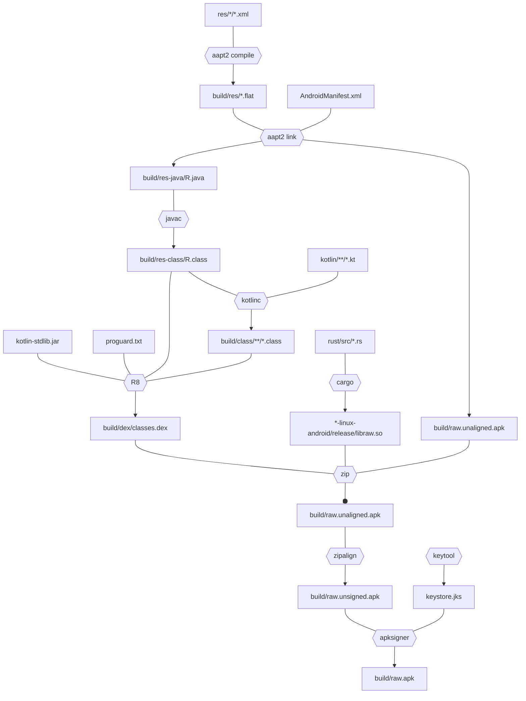

# raw-android-modern-app

Minimal example of android app in modern languages (Rust, Kotlin),
built directly with [Build Tools](https://developer.android.com/studio/command-line#tools-build)
(no 1GiB+ RAM gradle daemon) and using only built-in android APIs*.

## Goals

I've started with excellent but outdated [tutorial](https://www.hanshq.net/command-line-android.html)
and set out to adapt it to current state of android development with quality of life improvements:

* Native part in Rust with `#[no_std]`
* "Managed" part in Kotlin without dependency on *kotlin-stdlib*

## Rust

Easy and straightforward.

* [Set](https://doc.rust-lang.org/cargo/reference/profiles.html#panic) panic behaviour to `abort` in `Cargo.toml`:
```toml
[profile.release]
panic = "abort"
```
* Implement [panic_handler](https://doc.rust-lang.org/nomicon/panic-handler.html) as call to `libc::abort()`:
```rust
#[panic_handler]
#[no_mangle]
pub extern fn rust_begin_panic(_info: &PanicInfo) -> ! {
    unsafe { libc::abort() }
}
```
(and then see it not being included into resulting binary as your code doesn't panic)
* [Generate](rust/build.rs) JNI bindings ([jni-sys](https://crates.io/crates/jni-sys) depends on *std*).
You can use `jni.h` from SDK:
```bash
export BINDGEN_EXTRA_CLANG_ARGS="--sysroot='$NDK/sysroot'"
```
* Build native library four times (you must use NDK's `clang` matching `minSdkVersion` from manifest):
```bash
RUSTFLAGS="-C linker=$NDK/bin/aarch64-linux-android21-clang" cargo build --release --target aarch64-linux-android

RUSTFLAGS="-C linker=$NDK/bin/armv7a-linux-androideabi21-clang" cargo build --release --target armv7-linux-androideabi

RUSTFLAGS="-C linker=$NDK/bin/i686-linux-android21-clang" cargo build --release --target i686-linux-android

RUSTFLAGS="-C linker=$NDK/bin/x86_64-linux-android21-clang" cargo build --release --target x86_64-linux-android
```

## *Kotlin

It's possible, but annoyingly cumbersome to write code that doesn't depend on *kotlin-stdlib*. For example
```kotlin
findViewById(R.id.text_view_id) as TextView
```
will generate call to `kotlin.jvm.internal.Intrinsics` to check value returned by `findViewById()`
is not null.

It can be avoided by writing code like:
```kotlin
(findViewById(R.id.text_view_id) as? TextView)?.apply {
}
// or
findViewById(R.id.text_view_id) as? TextView ?: return
```
and then continuing to write whole app in such defensive manner.

(Un)fortunately we have [ProGuard](https://www.guardsquare.com/manual/home) and it's analogue by Google
[R8](https://android-developers.googleblog.com/2018/11/r8-new-code-shrinker-from-google-is.html) to
only include classes we actually use from *kotlin-stdlib* into final `.apk`.

Additionally `kotlinc` has several options to reduce number of references it generates to
*kotlin-stdlib* at the same time reducing debuggability:
* `-Xno-call-assertions` — Don't generate not-null assertions for arguments of platform types
* `-Xno-param-assertions` — Don't generate not-null assertions on parameters of methods accessible from Java
* `-Xno-receiver-assertions` — Don't generate not-null assertion for extension receiver arguments of platform types

## Building `.apk`



### [Resources](https://developer.android.com/guide/topics/resources/providing-resources) `res/*/*.xml`

Resources are processed by [aapt2](https://developer.android.com/studio/command-line/aapt2) tool from
Build Tools.

First they are compiled into `.flat` binary format:
```bash
"$BUILD_TOOLS/aapt2" compile res/*/*.xml -o build/res
```
then linked with manifest into proto-apk
```bash
"$BUILD_TOOLS/aapt2" link -o build/raw.unaligned.apk --manifest AndroidManifest.xml ... build/res/*.flat
```

In large projects for incremental builds you will call `compile` on changed resources individually.

`link` as a side-effect generates `R.java` for addressing resources from code.

### `R.java`

Simply compiled with `javac`:
```bash
javac ... R.java
```

### Kotlin source code

Compiled with `kotlinc`. Requires Android SDK and compiled `R.java` on classpath:
```bash
kotlinc -classpath "$PLATFORM/android.jar:build/res-class" ... kotlin/app/raw/*.kt
```

### `classes.dex`

`.dex` is Android's VM bytecode analogous to `.class`.

There are several compilers/translators in Build Tools. Used here is R8 which additionally can apply
ProGuard rules to exclude unused code and minify result.

For whatever reason Google does not include executable interface for it. You have to call it manually:
```bash
java -cp "$BUILD_TOOLS/lib/d8.jar" com.android.tools.r8.R8 \
    ... \
    --pg-conf proguard.txt \
    /usr/share/kotlin/lib/kotlin-stdlib.jar \
    /usr/share/kotlin/lib/annotations-13.0.jar \
    build/res-class/app/raw/*.class \
    build/class/app/raw/*.class
```

You can then check which classes from *kotlin-stdlib* were included:
```
$ "$BUILD_TOOLS/dexdump" -d classes.dex | grep kotlin -C 1
00032e: 7010 0b00 0800                         |0011: invoke-direct {v8}, Ljava/lang/NullPointerException;.<init>:()V // method@000b
000334: 1c01 0e00                              |0014: const-class v1, Lkotlin/jvm/internal/Intrinsics; // type@000e
000338: 6e10 0a00 0100                         |0016: invoke-virtual {v1}, Ljava/lang/Class;.getName:()Ljava/lang/String; // method@000a
--
Class #1            -
  Class descriptor  : 'Lkotlin/jvm/internal/Intrinsics;'
  Access flags      : 0x0401 (PUBLIC ABSTRACT)
```

There seem to be no intended tool to put `classes.dex` into `.apk`. You just use `zip`:
```bash
zip --junk-paths build/raw.unaligned.apk build/dex/classes.dex
```

### Native libraries

After [building](#rust) you need to put binaries for each target into specific directories inside `.apk`:
| Target | Path in `.apk` |
| --- | --- |
| aarch64-linux-android | lib/arm64-v8a/ |
| armv7-linux-androideabi | lib/armeabi-v7a/ |
| i686-linux-android | lib/x86/ |
| x86_64-linux-android | lib/x86_64/ |

### `.apk` aligning

You need to align `.apk` as [an optimization](https://developer.android.com/studio/command-line/zipalign):
```bash
"$BUILD_TOOLS/zipalign" -v -p 4 raw.unaligned.apk raw.unsigned.apk
```

### Signing

To be able to install `.apk` on device or emulator it must be signed. For this purpose
Build Tools has [apksigner](https://developer.android.com/studio/command-line/apksigner).

You can generate new key with [keytool](https://docs.oracle.com/en/java/javase/11/tools/keytool.html)
included into Java distribution:
```bash
keytool -genkeypair -keystore keystore.jks ...
```
and then sign your `.apk`:
```bash
"$BUILD_TOOLS/apksigner" sign --ks keystore.jks ... --out raw.apk raw.unsigned.apk
```

### Installing

That's all. You can install assembled `.apk` to connected device or emulator and launch app with:
```bash
adb install -r raw.apk && adb shell am start -n app.raw/.MainActivity
```

## Android App Bundle `.aab`

Used for posting apps to Google Play. Can be built with
[bundletool](https://developer.android.com/studio/command-line/bundletool), which for some reason
isn't included into Build Tools.
